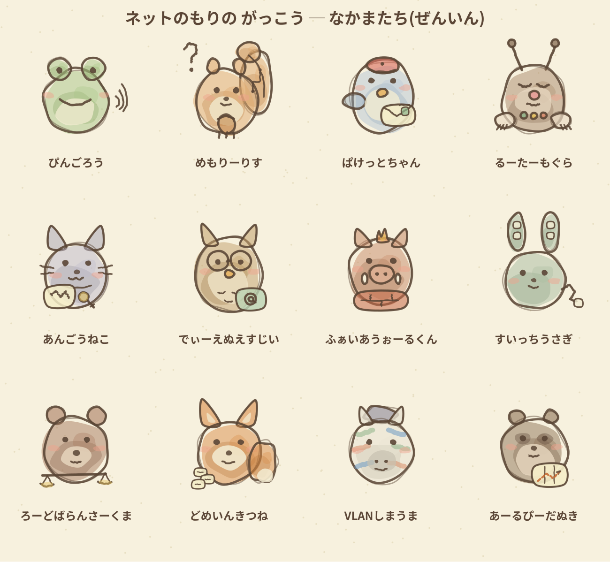

# ネットのもりの がっこう 🌰

中学生レベルから基本情報技術者(FE)試験の入り口まで、ネットワークとセキュリティを
ゲーム感覚で学べる無料の学習アプリです。登録不要・ブラウザだけで動きます。

**▶ あそぶ:** https://<ユーザー名>.github.io/<リポジトリ名>/

## あそびかた

1. **じゅぎょう** — 動物の先生たちのスライドで学ぶ(全47章)
2. **しょうテスト** — クイズに正解して木のみコインをあつめる(全303問)
3. **どんぐりガチャ** — コイン10枚で1回。なかまを12匹あつめよう
4. **そつぎょう認定試験** — 8割合格でSRなかまが確定でもらえる!

なかまが増えるとテストのコインボーナスが増えます。

## カリキュラム

| 学年 | テーマ |
|------|--------|
| 1ねんせい | コンピュータきそ(2進数・CPU・OS・ファイル) |
| 2ねんせい | ネットワークきそ(LAN/WAN・IP・DNS・HTTP・OSI) |
| 3ねんせい | サーバーにゅうもん(Web・DB・クラウド・TCP/UDP・ポート) |
| 4ねんせい | セキュリティきそ(パスワード・暗号・公開鍵・電子署名・認証) |
| 5ねんせい | じっせんセキュリティ(FW・脆弱性・マルウェア・DDoS・SQLi) |
| 6ねんせい(専攻科) | ネットワーク応用(ルーティング・VLAN・無線・パリティ・伝送速度) |
| 7ねんせい(専攻科) | インフラ設計と運用(冗長化・負荷分散・稼働率・VPN・DHCP・メール) |
| そつぎょう | 計算ドリル・用語テスト・FE風模擬試験・認定試験 |

## 技術メモ

- React 18 + Babel Standalone の単一HTMLファイル構成(ビルド不要)
- キャラクターは手描き水彩風のSVGをPythonでプロシージャル生成
- 進捗はページを閉じるとリセットされます(仕様)

## ライセンス

キャラクター・文章・コードはすべてオリジナルです。学習目的での利用は自由にどうぞ。
